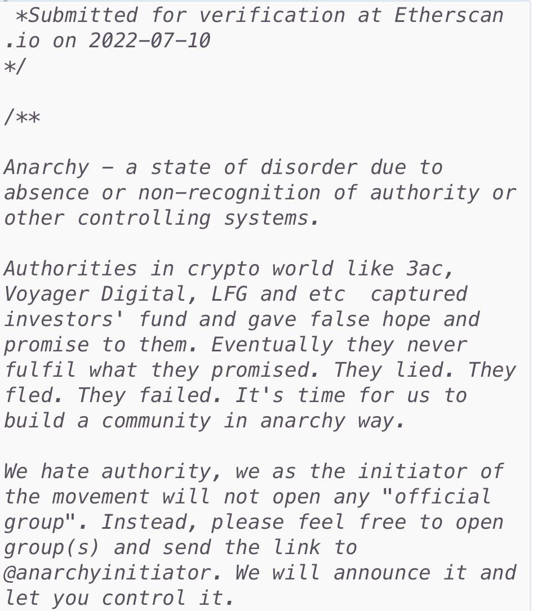

<html lang="en-US" class="no-js">
<head>
	<meta charset="UTF-8" />
	<meta name="viewport" content="width=device-width, initial-scale=1, maximum-scale=1" />
	<title>Anarchy Token - We are coming soon!</title>
	
	<!-- Seo Tags -->
	<meta name="description" content="Your page description here" />
	<meta name="keywords" content="Your meta keywords, here"/>
	<meta name="robots" content="index, follow"> 

	<!-- Favicon -->
	<link rel="shortcut icon" href="favicon.ico" type="image/x-icon">
	<link rel="icon" href="favicon.ico" type="image/x-icon">

	<!-- Included CSS Files -->
	<link href="https://fonts.googleapis.com/css?family=Sansita:400,400i,700,700i,800,800i,900,900i" rel="stylesheet">
	<link href='http://maxcdn.bootstrapcdn.com/font-awesome/4.7.0/css/font-awesome.min.css' rel='stylesheet' type='text/css'>
	<link rel="stylesheet" type="text/css" media="all" href="css/style.css" />
	
	<!--[if lt IE 9]>
		<link rel="stylesheet" type="text/css" media="all" href="css/ie.css" />
	<![endif]-->
</head>

<body>
	
	<!-- Loading -->
	

		

			

			

  		
			

				

			

		

	

	
	

		<!-- Main -->
		

			

				<!-- Header -->
				<header class="site-header">
					<h1 class="site-title"></h1>
				</header>

				<!-- Content -->
				<section class="content">

					<h1 class="section-title">Anarchy is knocking at your door</h1>
					
We're working on our new website! In the meanwhile you can Join us in our social profiles and Telegram.

					
					<!-- Modal page toggle -->
					

					<a href="#" id="modal-open" class="button-about">About</a>
					<a href="https://app.uniswap.org/#/swap?outputCurrency=0x53fD2342B43eCD24AEf1535BC3797F509616Ce8c&chain=mainnet" target="_blank" class="button-about">Buy Anarchy</a>
					

					

						<a href="https://www.dextools.io/app/ether/pair-explorer/0x0883012fd201384f03ca6f68d025e934328c3437" target="_blank" class="button-about">Chart</a>
						<a href="https://linktr.ee/anarchyerc" target="_blank" class="button-about">LinkTree</a>
						

					<!-- Social links -->
					

                            <a href="https://twitter.com/anarchyerc" target="_blank"></a>
                            <a href="https://t.me/anarchytokeneth" target="_blank"></a>
					

					
				</section>
			

		

		<!-- Modal page: About Us -->
		

			

				<!-- Modal toggle -->
				

					<a href="#" id="modal-close"></a>
				

				<!-- Content -->
				<section class="content">
					
					<h1 class="section-title">How it happened</h1>
					
					<!-- Columns -->
					

						

							
Welcome to true #ANARCHY. This all started by an anarchist anon dev who deployed an ERC20 contract using the anarchyinitiator.eth deployer.
								 
								The following comments were written in the CA as seen below:

								
							
 People noticed the CA, picked it up, created a community TG, then a community Twitter account, then started shilling while creating memes and so many more things. This is pure madness. This started forming a large group of anarchists who all work together with no hierarchy or authority and with two simple goals. To spread #ANARCHY like wild fire and to define the notion of #ANARCHY in the context of crypto space.

						

					

				</section>

			

		

				<!-- Modal page: Subscribe -->
		

			

				<!-- Modal toggle -->
				

					<a href="#" id="modal2-close"></a>
				

				<!-- Content -->
				<section class="content">
					
					<h1 class="section-title">Subscribe</h1>
					
					<!-- Columns -->
						
Notify Me When It's Ready

						
Lorem ipsum dolor sit amet, consectetur adipiscing elit, sed do eiusmod tempor incididunt ut labore et dolore magna aliqua.

							<!-- subscribe form -->
					

						<form action="subscribe.php" method="post" id="subscribe-form">
							

								<label for="subscribe_email" class="screen-reader-text">Your email</label>
								<input type="text" name="subscribe_email" id="subscribe_email" value="" placeholder="Your email" />
							

							

								<input type="submit" name="subscribe_submit" id="subscribe_submit" value="Subscribe" />
							

						</form>
					

				</section>
			

		

	

	<!-- Background overlay -->
	

	
	<!-- YouTube background video -->
	
	

		<a id="bg-video-volume" class="fa fa-sound" href="#" title="Mute">Mute</a>
		<a id="bg-video-play" class="fa fa-pause" href="#" title="Pause">Pause</a>
	

	<!-- Included JS Files -->
	
	
	
	
</body>
</html>
